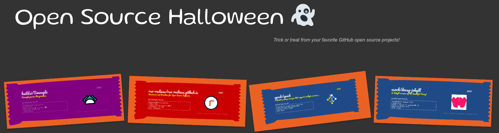

# Open Source Halloween!



What's an easy way to have fun, and celebrate an open source Halloween? Open source trick or treating, of course! The repository and interface here is our trick or treat bag that we've discovered across the open source landscape. You can participate here too! 

## How does it work?

1. Generate a candy for your repository with the [candy generator](https://vsoch.github.io/candy-generator)
2. Take a screenshot of your candy, tight around the edges!
3. Save it somewhere in your repository named "open-source-halloween-2021.png" (or the current year for the future)

And that's it! The interface here runs a [nightly job](.github/workflows/generate.yml) to search for these files, meaning that if GitHub has indexed it, it should show up. If you run into any issues with the generator please [open an issue[](https://vsoch.github.io/candy-generator/issues), or even better, a pull request with your suggested changes.

If you see any candy that violates [GitHub's terms of service](https://docs.github.com/en/github/site-policy/github-terms-of-service) please report the repository to GitHub, and also [open an issue here](https://github.com/rseng/open-source-halloween) to remove the file.

🦇️ [View the Treat Bag](https://rseng.github.io/open-source-halloween/) 🦇️

or if you haven't generated a candy for your repository yet:

🍬️ [Generate your Candy!](https://vsoch.github.io/candy-generator/) 🍬️


## Usage

The instructions here are for running the generator locally.

### Install Dependencies

First install requirments:

```bash
python -m venv env
pip install -r requirements.txt
```

### Environment

You'll need to export a personal access token as `GITHUB_TOKEN`:

```bash
export GITHUB_TOKEN=xxxxxxxxxxx
```

### Run update script

Time to go trick or treating!

```bash
python trick-or-treat.py
```

This should be run nightly to update the [candy](_candy) here.
